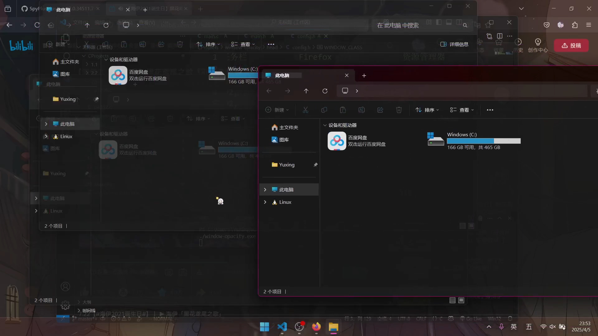

# 简介

该项目通过调用 Windows API 单独设置每个窗口的透明度

# 预览



# 依赖

```powershell
winget install winlibs
winget install ezwinports.make
winget install Microsoft.Git
```

# 安装

```powershell
git clone https://github.com/BreakTheMyth/window-opacity.git && cd window-opacity
make install
```

# 卸载

```powershell
make uninstall
```

# 使用

打开 head/config.h 文件，添加需要的配置，删除不需要的配置 (可使用 spy++ 等工具获取窗口类型和标题)

```c
// head/config.h                                      记事本      QQ                   任务栏            Firefox               资源管理器
#define /*窗口的标题*/            WINDOW_TITLE         NULL,      NULL,                 NULL,            NULL,                 NULL
#define /*窗口的类名*/            WINDOW_CLASS         "Notepad", "Chrome_WidgetWin_1", "Shell_TrayWnd", "MozillaWindowClass", "CabinetWClass"
#define /*窗口失去焦点时的透明度*/ WINDOW_OPACITY       192,       192,                  192,             192,                  192
#define /*窗口获得焦点时的透明度*/ WINDOW_FOCUS_OPACITY 224,       224,                  192,             224,                  224
```

修改完后进行调试

```powershell
make run
```


调试完后重新安装

```powershell
make install
```

程序会在下次开机时启动

# 
