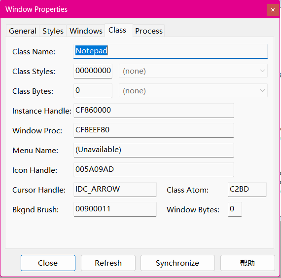

# 简介

该项目通过调用 Windows API 单独设置每个窗口的透明度

# 预览


# 安装

1. 下载 [window-opacity.exe](https://github.com/BreakTheMyth/window-opacity/releases/)

2. 将下载到本地的 **window-opacity.exe** 移动到合适的位置，并为其创建 **快捷方式**，将 **快捷方式** 移动至 `C:\Users\%USERNAME%\AppData\Roaming\Microsoft\Windows\Start Menu\Programs\Startup` 目录中

3. 重启电脑后会自动启动

# 卸载

1. 删除 **window-opacity.conf**, **window-opacity.exe** 以及其 **快捷方式**

# 配置

1. 首次运行时，会在 **window-opacity.exe** 所在的目录中生成一个名为 **window-opacity.conf** 的配置文件

2. 使用 [spy++](https://github.com/westoncampbell/SpyPlusPlus) 等工具获取窗口的类名和标题名

    - 建议选择顶层窗口

    

    - 这是窗口类名

    

    - 这是窗口标题

    

3. 配置文件格式如下

```ini
# 注释
完整的窗口类名 [失去焦点时的透明度，默认值为1] [获得焦点时的透明的，默认值为1]
	窗口标题中包含的关键字 [失去焦点时的透明度] [获得焦点时的透明的]

# 示例
Notepad 0.8 0.9
	" - Notepad" 0.8 0.9

# 解释：	
# Notepad为记事本的类名，可填*匹配所有窗口类名，后面0.8为没有焦点时的透明度(透明度范围：0~1)，0.9为获得焦点时的透明度，两个透明度可省略，在下面的窗口标题后面单独指定，都不指定则透明度为1，即完全不透明
# " - Notepad"为记事本的窗口标题特征字段，这个字符串有空格，需要添加""，如果类名不为*，此处可填*匹配所有Notepad类的窗口的标题
```

# 补充

- 不建议直接打开 **window-opacity.exe**，也不建议直接通过任务管理器结束该进程
- 同时点击鼠标的 **左键** 与 **右键** 可暂时恢复窗口原本的不透明度，再同时点击鼠标 **左键** 和 **右键** 则继续由 **window-opacity.exe** 接管窗口的不透明度
- 同时按下鼠标的 **左键** 与 **右键** 2秒以上可重新加载配置文件，5秒以上可退出程序，并恢复窗口原本的不透明度